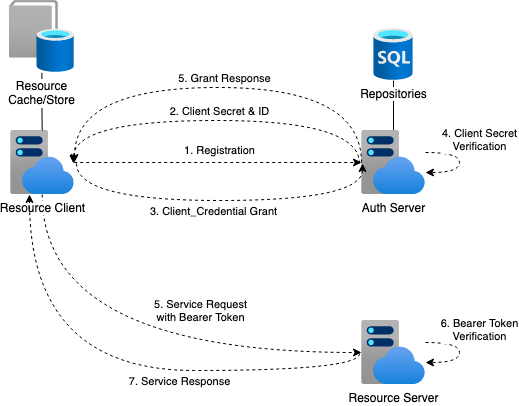

# Simple Auth Server
  As more and more organizations adopting RESTful API approach for providing digitalized services, external/internal cybersecurity has become a critical topic of most organizations. The traditional authentication and authorization methods, such as Kerberos and Windows Authentication, are cumbersome for the these modern JSON-based APIs. Another disadvantage is that they may slow down performance due to DNS inquiry and becomes subject to Dos (Denial of service) attack. OAuth framework has been created to simplify the authentication and authorization mechanism.
  Recently I have started implementing a simple version of Authorization Server based on the newly published RFC-6749 (The OAuth 2.0 Authorization Framework) with Python language as an open-source project. The initial implementation of the framework i have chosen is Client Credential Grant (a.k.a. Machine-to-Machine, M2M, Grant) among other four popular grants/methods. Anyone is welcome to download the source code and try it out. Since this is still in the prototyping phase, many error handling and testing need to be done. The diagram below illustrates how this service works for the M2M grant.
  
  
  